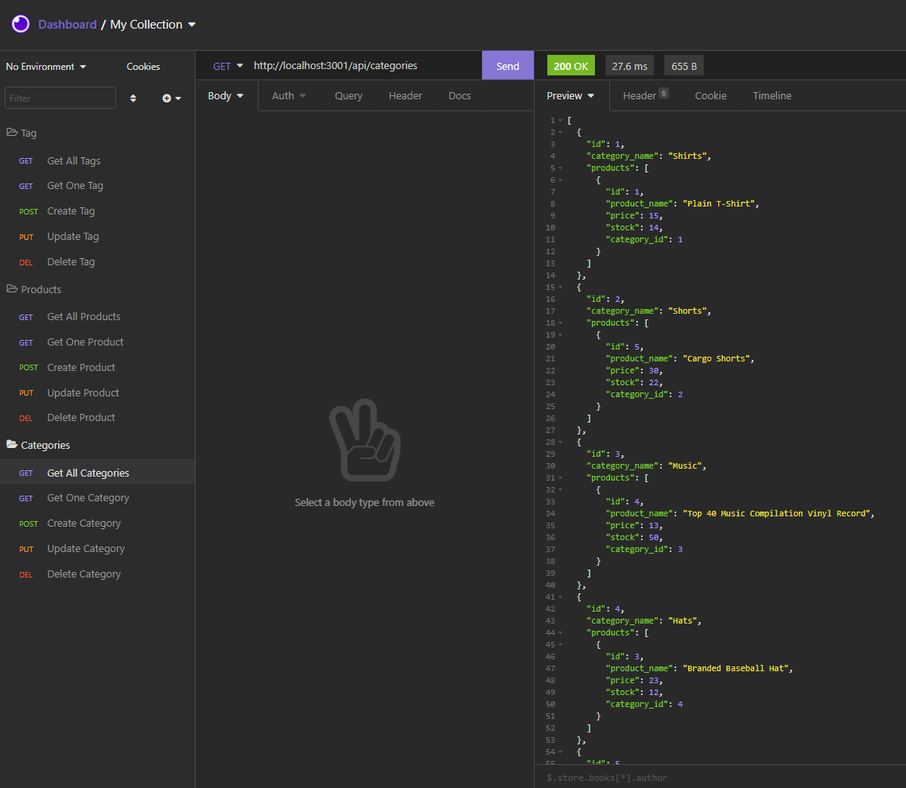

# E-Commerce Backend

E-Commerce backend that utilizes Express.js API, Sequelize to retrieve, update and delete of Categories, Products, Tags.

## User Story

```md
AS A manager at an internet retail company
I WANT a back end for my e-commerce website that uses the latest technologies
SO THAT my company can compete with other e-commerce companies
```

## Set up

Must have a .env file that contains the following:

>DB_USER=
>DB_PW=
>DB_NAME='ecommerce_db'

`npm install` to install dependencies.

`npm run seed` to seed example database.

## How to use it

`npm run start` to start server

`npm run watch` to start developer server

## Live Demostration

## API



## License

[License](./LICENSE)

